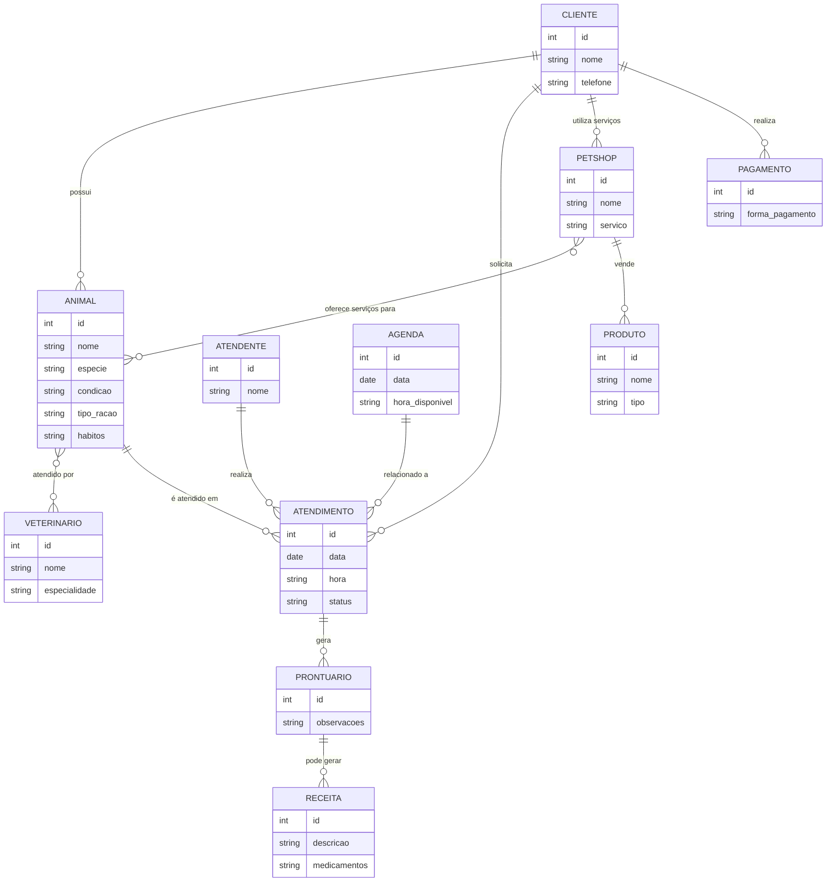
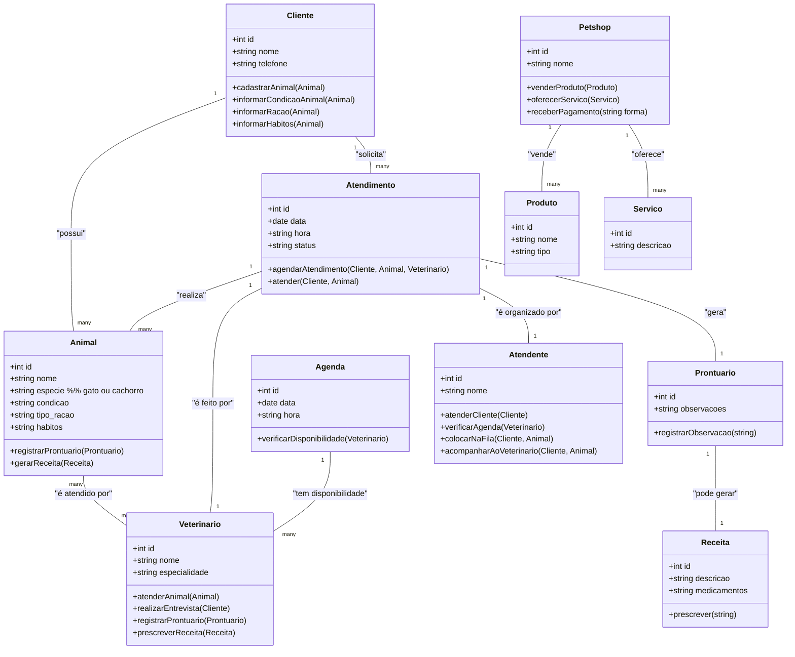
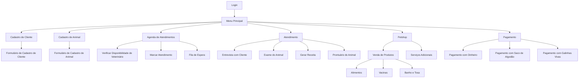
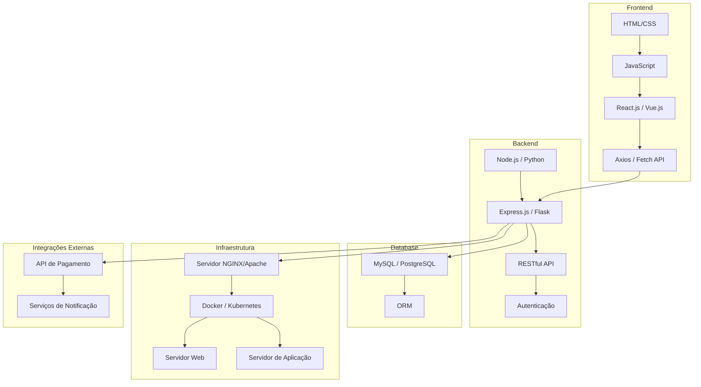

# Elber_Alves
Página da disciplina de Engenharia de Software

- [Elber\_Alves](#elber_alves)
- [1. Introdução](#1-introdução)
- [2. Descrição do sistema](#2-descrição-do-sistema)
  - [2.1. Descrição do cenario onde o sistema deverá funcionar:](#21-descrição-do-cenario-onde-o-sistema-deverá-funcionar)
- [3. Visão geral do sistema](#3-visão-geral-do-sistema)
  - [3.1. Descrição do sistema e suas relações](#31-descrição-do-sistema-e-suas-relações)
- [4. Diagrama ER](#4-diagrama-er)
  - [4.1. Descrição das Entidades e Relacionamentos](#41-descrição-das-entidades-e-relacionamentos)
  - [4.2. Relacionamentos](#42-relacionamentos)
- [5. Diagrama de classe](#5-diagrama-de-classe)
  - [5.1. Descrição das Classes e Relacionamentos](#51-descrição-das-classes-e-relacionamentos)
  - [5.2. Relacionamentos](#52-relacionamentos)
- [6. Casos de uso](#6-casos-de-uso)
  - [6.1. Casos de uso](#61-casos-de-uso)
  - [6.2. Historia de Usuario](#62-historia-de-usuario)
    - [Clínica Veterinária](#clínica-veterinária)
      - [1. Cadastro de Cliente e Animal](#1-cadastro-de-cliente-e-animal)
      - [2. Informar Condições do Animal](#2-informar-condições-do-animal)
      - [3. Informar Tipo de Ração do Animal](#3-informar-tipo-de-ração-do-animal)
      - [4. Informar Hábitos do Animal](#4-informar-hábitos-do-animal)
      - [5. Atendimento por Vários Veterinários](#5-atendimento-por-vários-veterinários)
      - [6. Atendimento Agendado](#6-atendimento-agendado)
      - [7. Ficha e Prontuário do Animal](#7-ficha-e-prontuário-do-animal)
      - [8. Agendar Atendimentos Futuros](#8-agendar-atendimentos-futuros)
      - [9. Receita Após o Atendimento](#9-receita-após-o-atendimento)
      - [10. Atendimento pelo Atendente](#10-atendimento-pelo-atendente)
      - [11. Fila de Espera](#11-fila-de-espera)
      - [12. Entrevista com o Dono do Animal](#12-entrevista-com-o-dono-do-animal)
      - [13. Preencher Formulário com Entrevista](#13-preencher-formulário-com-entrevista)
      - [14. Exame do Animal e Prontuário](#14-exame-do-animal-e-prontuário)
      - [15. Receita Dependendo do Exame](#15-receita-dependendo-do-exame)
    - [Petshop](#petshop)
      - [16. Venda de Ração para Pássaros](#16-venda-de-ração-para-pássaros)
      - [17. Venda de Sal para Boi](#17-venda-de-sal-para-boi)
      - [18. Venda de Vacina para Animais Adultos](#18-venda-de-vacina-para-animais-adultos)
      - [19. Banho e Tosa para Animais de Fazenda](#19-banho-e-tosa-para-animais-de-fazenda)
      - [20. Vacina para Animais com Raiva](#20-vacina-para-animais-com-raiva)
      - [21. Limpeza de Pata de Camelo](#21-limpeza-de-pata-de-camelo)
      - [22. Banho em Gansos da Finlândia](#22-banho-em-gansos-da-finlândia)
      - [23. Ajuda na Domesticação](#23-ajuda-na-domesticação)
      - [24. Preenchimento de Caderneta de Vacinação](#24-preenchimento-de-caderneta-de-vacinação)
      - [25. Design na Penugem](#25-design-na-penugem)
      - [26. Pagamento com Saco de Algodão](#26-pagamento-com-saco-de-algodão)
      - [27. Pagamento com Galinhas Vivas](#27-pagamento-com-galinhas-vivas)
    - [Clínica Veterinária](#clínica-veterinária-1)
      - [1. Cadastro de Cliente e Animal](#1-cadastro-de-cliente-e-animal-1)
      - [2. Informar Condições do Animal](#2-informar-condições-do-animal-1)
      - [3. Informar Tipo de Ração do Animal](#3-informar-tipo-de-ração-do-animal-1)
      - [4. Informar Hábitos do Animal](#4-informar-hábitos-do-animal-1)
      - [5. Atendimento por Vários Veterinários](#5-atendimento-por-vários-veterinários-1)
      - [6. Atendimento Agendado](#6-atendimento-agendado-1)
      - [7. Ficha e Prontuário do Animal](#7-ficha-e-prontuário-do-animal-1)
      - [8. Agendar Atendimentos Futuros](#8-agendar-atendimentos-futuros-1)
      - [9. Receita Após o Atendimento](#9-receita-após-o-atendimento-1)
      - [10. Atendimento pelo Atendente](#10-atendimento-pelo-atendente-1)
      - [11. Fila de Espera](#11-fila-de-espera-1)
      - [12. Entrevista com o Dono do Animal](#12-entrevista-com-o-dono-do-animal-1)
      - [13. Preencher Formulário com Entrevista](#13-preencher-formulário-com-entrevista-1)
      - [14. Exame do Animal e Prontuário](#14-exame-do-animal-e-prontuário-1)
      - [15. Receita Dependendo do Exame](#15-receita-dependendo-do-exame-1)
    - [Petshop](#petshop-1)
      - [16. Venda de Ração para Pássaros](#16-venda-de-ração-para-pássaros-1)
      - [17. Venda de Sal para Boi](#17-venda-de-sal-para-boi-1)
      - [18. Venda de Vacina para Animais Adultos](#18-venda-de-vacina-para-animais-adultos-1)
      - [19. Banho e Tosa para Animais de Fazenda](#19-banho-e-tosa-para-animais-de-fazenda-1)
      - [20. Vacina para Animais com Raiva](#20-vacina-para-animais-com-raiva-1)
      - [21. Limpeza de Pata de Camelo](#21-limpeza-de-pata-de-camelo-1)
      - [22. Banho em Gansos da Finlândia](#22-banho-em-gansos-da-finlândia-1)
      - [23. Ajuda na Domesticação](#23-ajuda-na-domesticação-1)
      - [24. Preenchimento de Caderneta de Vacinação](#24-preenchimento-de-caderneta-de-vacinação-1)
      - [25. Design na Penugem](#25-design-na-penugem-1)
      - [26. Pagamento com Saco de Algodão](#26-pagamento-com-saco-de-algodão-1)
      - [27. Pagamento com Galinhas Vivas](#27-pagamento-com-galinhas-vivas-1)
- [7. Diagrama de componentes](#7-diagrama-de-componentes)
- [8. Diagrama de Implantação](#8-diagrama-de-implantação)
- [9. Protótipo de telas](#9-protótipo-de-telas)
  - [9.1 Tela de Cadastro de Agenda](#91-tela-de-cadastro-de-agenda)
    - [9.1.1 Relatório de Agenda](#911-relatório-de-agenda)
    - [9.1.2 Detalhe de Agenda](#912-detalhe-de-agenda)
    - [9.1.3 Registro de Agenda](#913-registro-de-agenda)
  - [9.2 Tela de Cadastro de Animal](#92-tela-de-cadastro-de-animal)
    - [9.2.1 Relatório de Animal](#921-relatório-de-animal)
    - [9.2.2 Registro de Animal](#922-registro-de-animal)
    - [9.2.3 Detalhes de Animal](#923-detalhes-de-animal)
  - [9.3 Tela de Cadastro de Atendente](#93-tela-de-cadastro-de-atendente)
    - [9.3.1 Relatório de Atendente](#931-relatório-de-atendente)
    - [9.3.2 Registro de Atendente](#932-registro-de-atendente)
    - [9.3.3 Detalhes de Atendente](#933-detalhes-de-atendente)
  - [9.4 Tela de Cadastro de Atendimento](#94-tela-de-cadastro-de-atendimento)
    - [9.4.1 Relatório de Atendimento](#941-relatório-de-atendimento)
    - [9.4.2 Registro de Atendimento](#942-registro-de-atendimento)
    - [9.4.3 Detalhes de Atendimento](#943-detalhes-de-atendimento)
  - [9.5 Tela de Cadastro de Cliente](#95-tela-de-cadastro-de-cliente)
    - [9.5.1 Relatório de Cliente](#951-relatório-de-cliente)
    - [9.5.2 Detalhe de Cliente](#952-detalhe-de-cliente)
    - [9.5.3 Registro de Cliente](#953-registro-de-cliente)
  - [9.6 Tela de Cadastro de Pagamento](#96-tela-de-cadastro-de-pagamento)
    - [9.6.1 Relatório de Pagamento](#961-relatório-de-pagamento)
    - [9.6.2 Detalhes de Pagamento](#962-detalhes-de-pagamento)
    - [9.6.3 Registro de Pagamento](#963-registro-de-pagamento)
  - [9.7 Tela de Cadastro de Petshop](#97-tela-de-cadastro-de-petshop)
    - [9.7.1 Relatório de Petshop](#971-relatório-de-petshop)
    - [9.7.2 Registro de Petshop](#972-registro-de-petshop)
    - [9.7.3 Detalhes de Petshop](#973-detalhes-de-petshop)
  - [9.8 Tela de Cadastro de Petshop\_Produtos](#98-tela-de-cadastro-de-petshop_produtos)
    - [9.8.1 Relatório de Petshop\_Produtos](#981-relatório-de-petshop_produtos)
    - [9.8.2 Detalhes de Petshop\_Produtos](#982-detalhes-de-petshop_produtos)
    - [9.8.3 Registro de Petshop\_Produtos](#983-registro-de-petshop_produtos)
  - [9.9 Tela de Cadastro de Petshop\_Serviços](#99-tela-de-cadastro-de-petshop_serviços)
    - [9.9.1 Relatório de Petshop\_Serviços](#991-relatório-de-petshop_serviços)
    - [9.9.2 Detalhes de Petshop\_Serviços](#992-detalhes-de-petshop_serviços)
    - [9.9.3 Registro de Petshop\_Serviços](#993-registro-de-petshop_serviços)
  - [9.10 Tela de Cadastro de Produtos](#910-tela-de-cadastro-de-produtos)
    - [9.10.1 Relatório de Produtos](#9101-relatório-de-produtos)
    - [9.10.2 Detalhes de Produtos](#9102-detalhes-de-produtos)
    - [9.10.3 Registro de Produtos](#9103-registro-de-produtos)
  - [9.11 Tela de Cadastro de Prontuário](#911-tela-de-cadastro-de-prontuário)
    - [9.11.1 Relatório de Prontuário](#9111-relatório-de-prontuário)
    - [9.11.2 Detalhes de Prontuário](#9112-detalhes-de-prontuário)
    - [9.11.3 Registro de Prontuário](#9113-registro-de-prontuário)
  - [9.12 Tela de Cadastro de Receita](#912-tela-de-cadastro-de-receita)
    - [9.12.1 Relatório de Receita](#9121-relatório-de-receita)
    - [9.12.2 Detalhes de Receita](#9122-detalhes-de-receita)
    - [9.12.3 Registro de Receita](#9123-registro-de-receita)
  - [9.13 Tela de Cadastro de Serviços](#913-tela-de-cadastro-de-serviços)
    - [9.13.1 Relatório de Serviços](#9131-relatório-de-serviços)
    - [9.13.2 Detalhes de Serviços](#9132-detalhes-de-serviços)
    - [9.13.3 Registro de Serviços](#9133-registro-de-serviços)
  - [9.14 Tela de Cadastro de Veterinário](#914-tela-de-cadastro-de-veterinário)
    - [9.14.1 Relatório de Veterinário](#9141-relatório-de-veterinário)
    - [9.14.2 Detalhes de Veterinário](#9142-detalhes-de-veterinário)
    - [9.14.3 Registro de Veterinário](#9143-registro-de-veterinário)
  - [9.15 Tela de Gráfico](#915-tela-de-gráfico)
    - [9.15.1 Gráfico em Pizza](#9151-gráfico-em-pizza)
    - [9.15.2 Gráfico em Barra](#9152-gráfico-em-barra)
  - [9.16 Tela de Dashboard](#916-tela-de-dashboard)
- [10 Diagrama de navegação](#10-diagrama-de-navegação)
- [11. Pilha tecnológica](#11-pilha-tecnológica)
- [12. Requisitos de sistemas](#12-requisitos-de-sistemas)
  - [12.1. Requisitos do Lado Cliente](#121-requisitos-do-lado-cliente)
  - [12.2. Requisitos do Lado Servidor](#122-requisitos-do-lado-servidor)
- [13. Considerações sobre segurança](#13-considerações-sobre-segurança)
  - [13.1. Lado Cliente](#131-lado-cliente)
  - [13.2. Lado Servidor](#132-lado-servidor)
- [14. Instalação, Manutenção e Novas funcionalidades](#14-instalação-manutenção-e-novas-funcionalidades)
  - [14.1. Instalação Servidor](#141-instalação-servidor)
  - [14.2. Manutenção](#142-manutenção)
  - [14.3. Novas funcionalidades](#143-novas-funcionalidades)
- [15. Treinamento](#15-treinamento)
    - [Treinamento do Lado Usuário](#treinamento-do-lado-usuário)
    - [Treinamento do Lado Administrador](#treinamento-do-lado-administrador)
- [16. Script SQL](#16-script-sql)
  - [16.1 Comandos create](#161-comandos-create)
  - [16.2 Comandos INSERT gerando dados ficticios;](#162-comandos-insert-gerando-dados-ficticios)
    - [16.2.1. Explicação dos dados ficticios](#1621-explicação-dos-dados-ficticios)
    - [Tabelas do Pet Shop](#tabelas-do-pet-shop)


# 1. Introdução

O projeto a seguir apresenta um sistema desenvolvido para uma pethop. A empresa é considerada micro e iniciou as atividades recentemente. Ao possuir serviços exclusivos, os sitemas presentes no mercado não se enquadra, desta forma, os proprietários decidiram desenvolver uma solução própria. Esta solução é detalhada a seguir:

---
# 2. Descrição do sistema

## 2.1. Descrição do cenario onde o sistema deverá funcionar:

1. Uma clínica veterinária atende apenas os animais: gatos e cachorros.

2. Os clientes devem fazer um cadastro de si e dos animais.

3. Os clientes devem informar as condições nas quais os animais chegam.

4. Os clientes devem informar o tipo de ração que o animal come.

5. O cliente deve informar hábitos do animal.

6. Para cada animal é possível que mais de um veterinário o atenda.

7. Os animais podem chegar e serem atendidos de acordo com uma agenda do dia. 

8. Cada animal atendido receberá uma ficha e um prontuário. 

9. Outros dono podem querer marcar horários de atendimento futuro. 

10. O atendimento gera uma receita para o animal. 

11. Quando um cliente chega na clínica veterinária ele é atendido por um atendente. 

12. O atendente deve verificar se existe agenda disponível com um veterinário. 

13. O atendente deve colocar o cliente e seu animal na fila de espera, se for o caso. 

14. O atendente deve levar o cliente e o animal até o veterinário. 

15. O veterinário deve realizar uma entrevista com o dono do animal. 

16. O resultado da entrevista deve ir para um formulário. 

17. O veterinário deverá examinar o animal e anotar em prontuário(ficha) suas observações. 

18. Dependendo da situação do animal este receberá uma receita.

19. O petshop vende ração de para passaros da especie gralha.

20. O petshop vende sal para boi.

21. O petshop vende vacina para animais adultos acima de 7 anos.

22. O petshop oferece banho e tosa para animais de fazendas.

23. O petshop oferece vacina de animais com raiva.

24. O petshop oferece limpeza de pata de camelo.

25. O petshop oferece banho a gansos da Finlandia.

26. O petshop ajuda o dono na domesticação.

27. O petshop preenche a cardeneta de vacinação.

28. O petshop faz designs na penugem.

29. Fazemos recebimento com saco de algodão.

30. Recebemos o pagamento com galinhas vivas.

---
# 3. Visão geral do sistema

## 3.1. Descrição do sistema e suas relações

**1. Cadastro de Cliente e Animal**: O sistema permite que o cliente faça o cadastro de si mesmo e de seus animais, informando detalhes essenciais como condições de saúde ao chegar e hábitos alimentares (tipo de ração e comportamentos do animal).

**2. Agendamento e Atendimento de Animais**: O cliente pode marcar atendimentos para seus animais, podendo consultar horários disponíveis com veterinários. O sistema gerencia essa agenda, colocando os animais na fila de espera quando necessário e permitindo agendamentos futuros.

**3. Atendimento Veterinário**: Quando um cliente chega à clínica, ele é recebido por um atendente, que organiza e guia o atendimento. O veterinário realiza uma entrevista com o dono e anota o estado e observações sobre o animal no prontuário, que é registrado eletronicamente. Caso o animal precise, uma receita médica será emitida.

**4. Gerenciamento de Fichas e Prontuários**: Cada animal atendido recebe uma ficha e um prontuário detalhado, que ficam disponíveis no sistema para que os clientes possam acompanhar o histórico médico de seus animais.

**6. Serviços do Pet Shop**: Além do atendimento veterinário, o pet shop oferece uma gama de serviços adicionais para o bem-estar dos animais. Entre os serviços incluem-se venda de ração específica, vacinas para animais adultos, serviços de banho e tosa para animais de fazenda, e serviços de estética como design de penugem.

**7. Pagamento Flexível**: O sistema permite uma variedade de métodos de pagamento, que vão desde os tradicionais até métodos menos convencionais, como pagamento em galinhas vivas ou com saco de algodão.

---
# 4. Diagrama ER

```python
print("Meu Diagrama")
```



## 4.1. Descrição das Entidades e Relacionamentos

1. **CLIENTE**
   - Representa o cliente que realiza o cadastro para acessar os serviços veterinários e do pet shop para seus animais.

2. **ANIMAL**
   - Representa os animais dos clientes, incluindo informações sobre espécie, condição física e hábitos.

3. **VETERINARIO**
   - Representa o veterinário responsável pelo atendimento dos animais na clínica.

4. **ATENDENTE**
   - Representa o atendente da clínica veterinária, que auxilia no processo de recepção e organização do atendimento.

5. **ATENDIMENTO**
   - Representa o processo de atendimento de um animal na clínica, registrando a data, hora e o status do atendimento.

6. **AGENDA**
   - Representa a agenda de atendimentos da clínica, com horários disponíveis para os veterinários atenderem os animais.

7. **PRONTUARIO**
   - Representa o prontuário médico do animal, onde o veterinário registra observações sobre o atendimento e o estado de saúde.

8. **RECEITA**
   - Representa a receita prescrita pelo veterinário, incluindo uma descrição e os medicamentos indicados.

9. **PETSHOP**
   - Representa o setor de pet shop, com os serviços oferecidos para os animais, como banho, tosa e vacinação.

10. **PRODUTO**
    - Representa os produtos vendidos pelo pet shop, como rações, vacinas e outros itens para animais.

11. **PAGAMENTO**
    - Representa os métodos de pagamento aceitos pelo sistema, permitindo a realização de pagamentos por diversos meios.

## 4.2. Relacionamentos

1. **CLIENTE possui ANIMAL**
   - Um cliente pode ter vários animais cadastrados na clínica.

2. **ANIMAL é atendido por VETERINARIO**
   - Um animal pode ser atendido por mais de um veterinário e um veterinário pode atender diversos animais.

3. **ATENDENTE realiza ATENDIMENTO**
   - O atendente é responsável por organizar e encaminhar o atendimento dos animais, podendo realizar vários atendimentos.

4. **CLIENTE solicita ATENDIMENTO**
   - Um cliente solicita um atendimento para cada um dos animais.

5. **ANIMAL é atendido em ATENDIMENTO**
   - Cada animal recebe atendimento, podendo ter diversos registros de atendimento na clínica.

6. **ATENDIMENTO gera PRONTUARIO**
   - Cada atendimento gera um prontuário que registra as observações do veterinário sobre o animal.

7. **PRONTUARIO pode gerar RECEITA**
   - Dependendo do atendimento, o prontuário pode gerar uma receita com prescrições para o animal.

8. **AGENDA relacionado a ATENDIMENTO**
   - A agenda organiza os horários disponíveis para que os atendimentos sejam realizados.

9. **CLIENTE utiliza serviços do PETSHOP**
   - O cliente pode contratar serviços oferecidos pelo pet shop para seus animais, como tosa e vacinação.

10. **PETSHOP oferece serviços para ANIMAL**
    - O pet shop disponibiliza serviços diversos para os animais cadastrados pelos clientes.

11. **PETSHOP vende PRODUTO**
    - O pet shop comercializa diversos produtos que os clientes podem adquirir para seus animais.

12. **CLIENTE realiza PAGAMENTO**
    - O cliente realiza o pagamento dos serviços e produtos através de diferentes formas de pagamento.

---
# 5. Diagrama de classe



## 5.1. Descrição das Classes e Relacionamentos

1. **Cliente**
     - Registra um novo animal associado ao cliente.
     - Registra a condição do animal.
     - Informa o tipo de ração que o animal consome.
     - Registra os hábitos do animal.

2. **Animal**
     - Registra um prontuário para o animal.
     - Emite uma receita para o animal.

3. **Veterinario**
     - Realiza o atendimento de um animal.
     - Realiza entrevista com o dono do animal.
     - Registra observações no prontuário do animal.
     - Prescreve uma receita para o animal.

4. **Atendente**
     - Realiza o atendimento inicial ao cliente.
     - Consulta a agenda do veterinário para verificar disponibilidade.
     - Adiciona cliente e animal à fila de espera.
     - Acompanha o cliente e o animal até o veterinário.

5. **Atendimento**
     - Agenda um atendimento para o cliente e seu animal com um veterinário.
     - Realiza o atendimento do cliente e animal.

6. **Agenda**
     - Verifica a disponibilidade de horário de um veterinário.

7. **Prontuario**
     - Registra uma observação no prontuário.

8. **Receita**
     - Prescreve medicamentos na receita.

9. **Petshop**
     - Registra a venda de um produto.
     - Oferece um serviço para o animal.
     - Registra o pagamento de um cliente.

## 5.2. Relacionamentos

1. **Cliente possui Animal**
   - Um cliente pode ter vários animais cadastrados.

2. **Animal é atendido por Veterinario**
   - Um animal pode ser atendido por vários veterinários, e um veterinário pode atender diferentes animais.

3. **Atendimento realiza Animal**
   - Um atendimento pode incluir vários animais.

4. **Atendimento é feito por Veterinario**
   - Cada atendimento é realizado por um veterinário.

5. **Atendimento é organizado por Atendente**
   - Cada atendimento é organizado por um atendente.

6. **Atendimento gera Prontuario**
   - Cada atendimento gera um prontuário para o animal atendido.

7. **Prontuario pode gerar Receita**
   - Um prontuário pode gerar uma receita, dependendo do caso do animal.

8. **Cliente solicita Atendimento**
   - O cliente pode solicitar múltiplos atendimentos para diferentes animais.

9. **Agenda tem disponibilidade para Veterinario**
   - A agenda armazena a disponibilidade dos horários dos veterinários.

10. **Petshop vende Produto**
    - O pet shop pode vender vários produtos.

11. **Petshop oferece Servico**
    - O pet shop pode oferecer diversos serviços para os animais dos clientes.

---
# 6. Casos de uso

## 6.1. Casos de uso


## 6.2. Historia de Usuario

### Clínica Veterinária

#### 1. Cadastro de Cliente e Animal
**Como** cliente,  
**Quero** cadastrar meus dados e os dados dos meus animais,  
**Para** que eu possa receber atendimento na clínica veterinária.

#### 2. Informar Condições do Animal
**Como** cliente,  
**Quero** informar as condições nas quais meu animal chega à clínica,  
**Para** que o veterinário saiba do estado de saúde do meu pet.

#### 3. Informar Tipo de Ração do Animal
**Como** cliente,  
**Quero** informar o tipo de ração que meu animal consome,  
**Para** garantir que o veterinário tenha informações completas sobre sua alimentação.

#### 4. Informar Hábitos do Animal
**Como** cliente,  
**Quero** fornecer informações sobre os hábitos do meu animal,  
**Para** que o veterinário tenha uma visão mais clara do seu comportamento e necessidades.

#### 5. Atendimento por Vários Veterinários
**Como** cliente,  
**Quero** que meu animal possa ser atendido por mais de um veterinário,  
**Para** garantir que ele receba o melhor cuidado possível.

#### 6. Atendimento Agendado
**Como** cliente,  
**Quero** agendar o atendimento do meu animal na clínica,  
**Para** garantir que ele seja atendido conforme a disponibilidade do veterinário.

#### 7. Ficha e Prontuário do Animal
**Como** veterinário,  
**Quero** criar uma ficha e prontuário para cada animal atendido,  
**Para** registrar as informações de saúde e histórico do animal.

#### 8. Agendar Atendimentos Futuros
**Como** cliente,  
**Quero** marcar horários de atendimento futuros para meu animal,  
**Para** garantir que ele tenha acompanhamento contínuo.

#### 9. Receita Após o Atendimento
**Como** veterinário,  
**Quero** gerar uma receita após o atendimento do animal,  
**Para** prescrever o tratamento adequado.

#### 10. Atendimento pelo Atendente
**Como** atendente,  
**Quero** verificar a disponibilidade na agenda dos veterinários,  
**Para** organizar os atendimentos e garantir que o animal seja atendido no horário correto.

#### 11. Fila de Espera
**Como** atendente,  
**Quero** colocar o cliente e seu animal na fila de espera,  
**Para** garantir que o atendimento ocorra quando o veterinário estiver disponível.

#### 12. Entrevista com o Dono do Animal
**Como** veterinário,  
**Quero** realizar uma entrevista com o dono do animal,  
**Para** entender melhor o histórico e as condições do animal.

#### 13. Preencher Formulário com Entrevista
**Como** veterinário,  
**Quero** registrar o resultado da entrevista em um formulário,  
**Para** documentar as informações fornecidas pelo dono do animal.

#### 14. Exame do Animal e Prontuário
**Como** veterinário,  
**Quero** examinar o animal e anotar minhas observações em seu prontuário,  
**Para** manter um registro completo do estado de saúde do animal.

#### 15. Receita Dependendo do Exame
**Como** veterinário,  
**Quero** prescrever uma receita conforme o exame do animal,  
**Para** garantir que ele receba o tratamento necessário.

---

### Petshop

#### 16. Venda de Ração para Pássaros
**Como** cliente,  
**Quero** comprar ração para pássaros da espécie gralha,  
**Para** alimentar adequadamente meu pássaro.

#### 17. Venda de Sal para Boi
**Como** cliente,  
**Quero** comprar sal para boi,  
**Para** suplementar a alimentação dos meus animais.

#### 18. Venda de Vacina para Animais Adultos
**Como** cliente,  
**Quero** comprar vacina para animais com mais de 7 anos,  
**Para** garantir a saúde dos meus pets.

#### 19. Banho e Tosa para Animais de Fazenda
**Como** cliente,  
**Quero** que meu animal de fazenda receba banho e tosa,  
**Para** garantir que ele esteja limpo e bem cuidado.

#### 20. Vacina para Animais com Raiva
**Como** cliente,  
**Quero** vacinar meus animais contra raiva,  
**Para** protegê-los de doenças.

#### 21. Limpeza de Pata de Camelo
**Como** cliente,  
**Quero** serviços de limpeza de pata de camelo,  
**Para** cuidar da higiene do meu camelo.

#### 22. Banho em Gansos da Finlândia
**Como** cliente,  
**Quero** dar banho em meus gansos da Finlândia,  
**Para** mantê-los limpos e saudáveis.

#### 23. Ajuda na Domesticação
**Como** cliente,  
**Quero** ajuda na domesticação do meu animal,  
**Para** melhorar seu comportamento e convivência.

#### 24. Preenchimento de Caderneta de Vacinação
**Como** cliente,  
**Quero** que o petshop preencha a caderneta de vacinação do meu animal,  
**Para** manter o controle das vacinas aplicadas.

#### 25. Design na Penugem
**Como** cliente,  
**Quero** que o petshop faça design na penugem do meu animal,  
**Para** deixá-lo com uma aparência única e estilosa.

#### 26. Pagamento com Saco de Algodão
**Como** cliente,  
**Quero** pagar com saco de algodão,  
**Para** usar um meio alternativo de pagamento aceito pela loja.

#### 27. Pagamento com Galinhas Vivas
**Como** cliente,  
**Quero** pagar com galinhas vivas,  
**Para** trocar produtos ou serviços do petshop por um meio de pagamento aceito.
### Clínica Veterinária

#### 1. Cadastro de Cliente e Animal
**Como** cliente,  
**Quero** cadastrar meus dados e os dados dos meus animais,  
**Para** que eu possa receber atendimento na clínica veterinária.

#### 2. Informar Condições do Animal
**Como** cliente,  
**Quero** informar as condições nas quais meu animal chega à clínica,  
**Para** que o veterinário saiba do estado de saúde do meu pet.

#### 3. Informar Tipo de Ração do Animal
**Como** cliente,  
**Quero** informar o tipo de ração que meu animal consome,  
**Para** garantir que o veterinário tenha informações completas sobre sua alimentação.

#### 4. Informar Hábitos do Animal
**Como** cliente,  
**Quero** fornecer informações sobre os hábitos do meu animal,  
**Para** que o veterinário tenha uma visão mais clara do seu comportamento e necessidades.

#### 5. Atendimento por Vários Veterinários
**Como** cliente,  
**Quero** que meu animal possa ser atendido por mais de um veterinário,  
**Para** garantir que ele receba o melhor cuidado possível.

#### 6. Atendimento Agendado
**Como** cliente,  
**Quero** agendar o atendimento do meu animal na clínica,  
**Para** garantir que ele seja atendido conforme a disponibilidade do veterinário.

#### 7. Ficha e Prontuário do Animal
**Como** veterinário,  
**Quero** criar uma ficha e prontuário para cada animal atendido,  
**Para** registrar as informações de saúde e histórico do animal.

#### 8. Agendar Atendimentos Futuros
**Como** cliente,  
**Quero** marcar horários de atendimento futuros para meu animal,  
**Para** garantir que ele tenha acompanhamento contínuo.

#### 9. Receita Após o Atendimento
**Como** veterinário,  
**Quero** gerar uma receita após o atendimento do animal,  
**Para** prescrever o tratamento adequado.

#### 10. Atendimento pelo Atendente
**Como** atendente,  
**Quero** verificar a disponibilidade na agenda dos veterinários,  
**Para** organizar os atendimentos e garantir que o animal seja atendido no horário correto.

#### 11. Fila de Espera
**Como** atendente,  
**Quero** colocar o cliente e seu animal na fila de espera,  
**Para** garantir que o atendimento ocorra quando o veterinário estiver disponível.

#### 12. Entrevista com o Dono do Animal
**Como** veterinário,  
**Quero** realizar uma entrevista com o dono do animal,  
**Para** entender melhor o histórico e as condições do animal.

#### 13. Preencher Formulário com Entrevista
**Como** veterinário,  
**Quero** registrar o resultado da entrevista em um formulário,  
**Para** documentar as informações fornecidas pelo dono do animal.

#### 14. Exame do Animal e Prontuário
**Como** veterinário,  
**Quero** examinar o animal e anotar minhas observações em seu prontuário,  
**Para** manter um registro completo do estado de saúde do animal.

#### 15. Receita Dependendo do Exame
**Como** veterinário,  
**Quero** prescrever uma receita conforme o exame do animal,  
**Para** garantir que ele receba o tratamento necessário.

---

### Petshop

#### 16. Venda de Ração para Pássaros
**Como** cliente,  
**Quero** comprar ração para pássaros da espécie gralha,  
**Para** alimentar adequadamente meu pássaro.

#### 17. Venda de Sal para Boi
**Como** cliente,  
**Quero** comprar sal para boi,  
**Para** suplementar a alimentação dos meus animais.

#### 18. Venda de Vacina para Animais Adultos
**Como** cliente,  
**Quero** comprar vacina para animais com mais de 7 anos,  
**Para** garantir a saúde dos meus pets.

#### 19. Banho e Tosa para Animais de Fazenda
**Como** cliente,  
**Quero** que meu animal de fazenda receba banho e tosa,  
**Para** garantir que ele esteja limpo e bem cuidado.

#### 20. Vacina para Animais com Raiva
**Como** cliente,  
**Quero** vacinar meus animais contra raiva,  
**Para** protegê-los de doenças.

#### 21. Limpeza de Pata de Camelo
**Como** cliente,  
**Quero** serviços de limpeza de pata de camelo,  
**Para** cuidar da higiene do meu camelo.

#### 22. Banho em Gansos da Finlândia
**Como** cliente,  
**Quero** dar banho em meus gansos da Finlândia,  
**Para** mantê-los limpos e saudáveis.

#### 23. Ajuda na Domesticação
**Como** cliente,  
**Quero** ajuda na domesticação do meu animal,  
**Para** melhorar seu comportamento e convivência.

#### 24. Preenchimento de Caderneta de Vacinação
**Como** cliente,  
**Quero** que o petshop preencha a caderneta de vacinação do meu animal,  
**Para** manter o controle das vacinas aplicadas.

#### 25. Design na Penugem
**Como** cliente,  
**Quero** que o petshop faça design na penugem do meu animal,  
**Para** deixá-lo com uma aparência única e estilosa.

#### 26. Pagamento com Saco de Algodão
**Como** cliente,  
**Quero** pagar com saco de algodão,  
**Para** usar um meio alternativo de pagamento aceito pela loja.

#### 27. Pagamento com Galinhas Vivas
**Como** cliente,  
**Quero** pagar com galinhas vivas,  
**Para** trocar produtos ou serviços do petshop por um meio de pagamento aceito.


---
# 7. Diagrama de componentes


---
# 8. Diagrama de Implantação


# 9. Protótipo de telas

## 9.1 Tela de Cadastro de Agenda

### 9.1.1 Relatório de Agenda


### 9.1.2 Detalhe de Agenda


### 9.1.3 Registro de Agenda


## 9.2 Tela de Cadastro de Animal

### 9.2.1 Relatório de Animal


### 9.2.2 Registro de Animal


### 9.2.3 Detalhes de Animal


## 9.3 Tela de Cadastro de Atendente

### 9.3.1 Relatório de Atendente


### 9.3.2 Registro de Atendente


### 9.3.3 Detalhes de Atendente


## 9.4 Tela de Cadastro de Atendimento

### 9.4.1 Relatório de Atendimento


### 9.4.2 Registro de Atendimento


### 9.4.3 Detalhes de Atendimento


## 9.5 Tela de Cadastro de Cliente

### 9.5.1 Relatório de Cliente


### 9.5.2 Detalhe de Cliente


### 9.5.3 Registro de Cliente


## 9.6 Tela de Cadastro de Pagamento

### 9.6.1 Relatório de Pagamento


### 9.6.2 Detalhes de Pagamento


### 9.6.3 Registro de Pagamento


## 9.7 Tela de Cadastro de Petshop

### 9.7.1 Relatório de Petshop


### 9.7.2 Registro de Petshop


### 9.7.3 Detalhes de Petshop


## 9.8 Tela de Cadastro de Petshop_Produtos

### 9.8.1 Relatório de Petshop_Produtos


### 9.8.2 Detalhes de Petshop_Produtos


### 9.8.3 Registro de Petshop_Produtos


## 9.9 Tela de Cadastro de Petshop_Serviços

### 9.9.1 Relatório de Petshop_Serviços


### 9.9.2 Detalhes de Petshop_Serviços


### 9.9.3 Registro de Petshop_Serviços


## 9.10 Tela de Cadastro de Produtos

### 9.10.1 Relatório de Produtos


### 9.10.2 Detalhes de Produtos


### 9.10.3 Registro de Produtos


## 9.11 Tela de Cadastro de Prontuário

### 9.11.1 Relatório de Prontuário


### 9.11.2 Detalhes de Prontuário


### 9.11.3 Registro de Prontuário


## 9.12 Tela de Cadastro de Receita

### 9.12.1 Relatório de Receita


### 9.12.2 Detalhes de Receita


### 9.12.3 Registro de Receita


## 9.13 Tela de Cadastro de Serviços

### 9.13.1 Relatório de Serviços


### 9.13.2 Detalhes de Serviços


### 9.13.3 Registro de Serviços


## 9.14 Tela de Cadastro de Veterinário

### 9.14.1 Relatório de Veterinário


### 9.14.2 Detalhes de Veterinário


### 9.14.3 Registro de Veterinário


## 9.15 Tela de Gráfico

### 9.15.1 Gráfico em Pizza


### 9.15.2 Gráfico em Barra


## 9.16 Tela de Dashboard


---
# 10 Diagrama de navegação



---
# 11. Pilha tecnológica



---
# 12. Requisitos de sistemas

## 12.1. Requisitos do Lado Cliente

1. **Cadastro de Cliente e Animal**
   - O cliente deve poder se cadastrar no sistema com seus dados pessoais (nome e telefone).
   - O cliente deve ser capaz de cadastrar um ou mais animais, fornecendo detalhes como espécie (gato ou cachorro), condição física, tipo de ração e hábitos.

2. **Consulta de Dados Pessoais e de Animais**
   - O cliente deve poder visualizar e atualizar suas informações pessoais.
   - O cliente deve poder consultar as informações registradas sobre seus animais.

3. **Agendamento de Atendimento**
   - O cliente deve poder solicitar e visualizar agendamentos de atendimento para seus animais.
   - O sistema deve exibir os horários disponíveis para atendimento com veterinários, permitindo que o cliente escolha o horário.

4. **Consulta de Histórico Médico**
   - O cliente deve poder acessar o histórico de atendimentos de seus animais, incluindo informações do prontuário e observações do veterinário.

5. **Emissão e Consulta de Receitas**
   - O cliente deve poder visualizar receitas médicas emitidas para seus animais após os atendimentos.
   - O cliente deve ter acesso a informações detalhadas sobre medicamentos prescritos.

6. **Solicitação de Serviços do Pet Shop**
   - O cliente deve poder visualizar e solicitar serviços oferecidos pelo pet shop, como banho, tosa, vacinação, etc.

7. **Compra de Produtos**
   - O cliente deve ter acesso ao catálogo de produtos vendidos pelo pet shop e poder realizar compras.

8. **Pagamento**
   - O cliente deve poder escolher entre diferentes formas de pagamento oferecidas pela clínica para os serviços e produtos adquiridos.
   - O cliente deve receber um comprovante ou confirmação de pagamento após a transação.

9. **Notificações e Lembretes**
   - O sistema deve enviar notificações para o cliente sobre o status do atendimento, lembretes de agendamento, atualizações sobre o histórico médico e receitas dos animais.

## 12.2. Requisitos do Lado Servidor

1. **Gestão de Cadastro de Clientes e Animais**
   - O servidor deve armazenar e gerenciar o cadastro de clientes e seus respectivos animais, incluindo dados como nome, telefone e informações dos animais (nome, espécie, condição, tipo de ração e hábitos).
   - Deve permitir atualizações de dados de clientes e animais a qualquer momento.

2. **Gerenciamento de Agendamentos e Agenda de Veterinários**
   - O servidor deve gerenciar a agenda dos veterinários, incluindo horários disponíveis e atendimentos já agendados.
   - Deve verificar a disponibilidade de horários e permitir que atendentes e clientes agendem, atualizem ou cancelem atendimentos.
   - Deve notificar o cliente e o veterinário sobre agendamentos confirmados, lembretes, cancelamentos ou alterações.

3. **Processamento de Atendimento**
   - O servidor deve gerenciar o fluxo de atendimento, permitindo o registro dos atendimentos e atribuindo o status (por exemplo, "pendente", "em andamento", "concluído").
   - Deve permitir o registro de observações médicas e prontuários feitos pelo veterinário durante o atendimento.

4. **Gestão de Prontuários e Receitas**
   - O servidor deve registrar e armazenar prontuários médicos de cada animal, com observações do veterinário sobre o estado de saúde e diagnósticos.
   - Deve permitir a emissão de receitas pelo veterinário, incluindo medicamentos prescritos, e vinculá-las ao prontuário do animal para consulta futura.

5. **Gerenciamento de Produtos e Serviços do Pet Shop**
   - O servidor deve armazenar um catálogo de produtos e serviços oferecidos pelo pet shop, incluindo detalhes como nome, tipo, descrição e preço.
   - Deve permitir o registro de vendas de produtos e a contratação de serviços, registrando detalhes de cada transação.

6. **Gestão de Pagamentos**
   - O servidor deve processar e armazenar informações sobre pagamentos realizados por clientes, permitindo múltiplas formas de pagamento (por exemplo, cartão, dinheiro, pagamentos alternativos).
   - Deve emitir confirmações de pagamento para clientes e gerar registros financeiros para o sistema administrativo.

7. **Controle de Usuários e Acessos**
   - O servidor deve gerenciar o acesso de diferentes tipos de usuários, incluindo clientes, atendentes e veterinários, aplicando permissões específicas para cada perfil.
   - Deve garantir que apenas usuários autenticados acessem dados e funcionalidades correspondentes aos seus papéis.

8. **Notificações e Alertas**
   - O servidor deve enviar notificações automáticas sobre agendamentos e lembretes de atendimento.
   - Deve alertar veterinários e atendentes sobre novos agendamentos e mudanças de status dos atendimentos.

9. **Segurança e Conformidade de Dados**
   - O servidor deve proteger dados sensíveis dos clientes e garantir o cumprimento das políticas de privacidade e proteção de dados.
   - Deve garantir que todas as comunicações e transações estejam protegidas por protocolos de segurança, como criptografia de dados.

10. **Relatórios e Histórico**
    - O servidor deve gerar relatórios para consulta de histórico de atendimentos, receitas emitidas, transações financeiras e registros de produtos e serviços.
    - Deve permitir a exportação de dados para análises periódicas.

---
# 13. Considerações sobre segurança

## 13.1. Lado Cliente

1. **Autenticação Segura**
   - Implementar autenticação por meio de senhas fortes, incluindo requisitos de complexidade (combinação de letras, números e caracteres especiais).
   - Oferecer autenticação multifator (MFA), como verificação por SMS ou aplicativo autenticador, para adicionar uma camada extra de segurança.

2. **Proteção de Dados Pessoais**
   - Armazenar localmente apenas o mínimo necessário de dados sensíveis e, sempre que possível, optar por sessões temporárias ou tokens criptografados para acesso ao servidor.
   - Garantir que dados sensíveis (como informações pessoais e de animais) sejam transmitidos por uma conexão segura (HTTPS).

3. **Controle de Sessão e Logoff Automático**
   - Implementar tempo limite para sessões inativas, forçando o logoff automático após um período de inatividade para evitar o acesso não autorizado.
   - Oferecer ao usuário uma opção de logout manual visível para que ele possa encerrar a sessão sempre que desejar.

4. **Validação de Entrada de Dados**
   - Validar todos os dados inseridos pelo cliente no lado do cliente e do servidor para evitar injeção de código, SQL Injection, e outros ataques.
   - Utilizar filtros para impedir a inserção de caracteres especiais ou scripts nos campos de entrada de dados.

5. **Proteção contra Phishing e Ataques Man-in-the-Middle (MitM)**
   - Verificar a autenticidade do servidor através de certificados digitais válidos (HTTPS) para garantir que os clientes estão conectados ao servidor correto.
   - Orientar os usuários sobre a importância de acessar o sistema apenas por meios oficiais e evitar acessar links de e-mails ou mensagens de fontes desconhecidas.

6. **Armazenamento Seguro de Credenciais e Tokens**
   - Evitar armazenar senhas ou informações sensíveis no armazenamento local do dispositivo. Para autenticação, utilizar tokens de acesso temporários e protegidos.
   - Sempre invalidar e renovar tokens em intervalos regulares para garantir que acessos antigos sejam revogados.

7. **Gerenciamento de Permissões e Acesso**
   - Implementar controles de acesso baseados em função (RBAC) para que os clientes acessem apenas suas informações e operações pertinentes, sem acesso a dados ou funcionalidades administrativas.

8. **Proteção Contra Software Malicioso**
   - Implementar proteção contra ataques de clickjacking (uso de iframes e overlays maliciosos) e phishing, utilizando configurações de segurança nos navegadores e dispositivos.

9. **Educação e Suporte ao Usuário**
   - Informar e educar os clientes sobre práticas seguras no uso do sistema, como uso de senhas fortes e boas práticas de segurança.
   - Disponibilizar um suporte rápido para que os clientes possam denunciar possíveis problemas de segurança ou comportamentos suspeitos.

## 13.2. Lado Servidor

1. **Autenticação e Controle de Acesso**
   - Implementar autenticação forte para todos os tipos de usuários (clientes, atendentes, veterinários) e garantir o uso de autenticação multifator (MFA) para acessos administrativos.
   - Implementar um controle de acesso baseado em funções (RBAC), garantindo que cada usuário tenha acesso apenas às funcionalidades e informações necessárias ao seu papel.
   - Registrar logs de autenticação e atividades de usuários para rastrear acessos e atividades incomuns.

2. **Criptografia de Dados**
   - Criptografar dados sensíveis tanto em trânsito quanto em repouso. Utilizar HTTPS com certificados SSL/TLS para a transmissão de dados e criptografia AES para o armazenamento de dados sensíveis no banco de dados.
   - Para informações altamente sensíveis, como senhas e dados de saúde, usar algoritmos de hashing (como bcrypt) com salt, impossibilitando a recuperação direta de senhas.

3. **Validação de Entrada e Prevenção de Injeções**
   - Implementar validações no lado do servidor para todas as entradas de dados, impedindo ataques de injeção SQL, comandos maliciosos, e scripts que possam comprometer o sistema.
   - Usar consultas preparadas ou ORM (Object-Relational Mapping) para evitar injeção de SQL.

4. **Proteção contra Ataques de Força Bruta e DDoS**
   - Implementar limites de tentativas de login com bloqueio temporário após várias tentativas falhas para reduzir o risco de ataques de força bruta.
   - Usar firewalls e técnicas de rate limiting para limitar o tráfego anômalo e identificar solicitações suspeitas, protegendo contra ataques de negação de serviço (DDoS).

5. **Gerenciamento de Sessão e Expiração de Tokens**
   - Usar tokens de sessão seguros, como JSON Web Tokens (JWT), e configurá-los com expiração curta, especialmente para sessões de acesso administrativo.
   - Invalidar tokens antigos e exigir renovação de sessões regularmente para evitar que acessos comprometidos sejam utilizados.

6. **Monitoramento de Segurança e Logs**
   - Implementar um sistema de monitoramento e análise de logs em tempo real para identificar e responder rapidamente a atividades suspeitas.
   - Armazenar logs de acesso e atividades administrativas em um ambiente seguro, analisando-os periodicamente para detectar padrões de ameaças.

7. **Backup e Recuperação de Dados**
   - Implementar backups regulares dos dados para garantir a disponibilidade em caso de incidentes de segurança, como ataques ransomware.
   - Os backups devem ser armazenados em local seguro e serem criptografados, garantindo que dados sensíveis não sejam comprometidos.

8. **Manutenção Regular e Patching**
   - Manter todos os softwares, frameworks e sistemas operacionais atualizados para corrigir vulnerabilidades conhecidas e reduzir o risco de exploração.
   - Realizar testes regulares de segurança e aplicar patches de segurança assim que lançados.

9. **Proteção contra Exposição de Dados e Configurações Inseguras**
   - Configurar o servidor para evitar a exposição de informações sensíveis e de configurações desnecessárias, como diretórios ou páginas de erro detalhadas.
   - Desabilitar serviços ou portas desnecessárias e revisar permissões de arquivos para garantir que dados críticos estejam acessíveis apenas por usuários e processos autorizados.

10. **Educação e Treinamento de Equipe**
    - Treinar a equipe técnica e administrativa sobre práticas de segurança, incluindo o reconhecimento de ameaças e resposta a incidentes.
    - Fornecer orientação sobre a importância de seguir boas práticas de segurança e políticas de conformidade.

---
# 14. Instalação, Manutenção e Novas funcionalidades

## 14.1. Instalação Servidor

   - Pré-requisitos: Antes da instalação, assegurar que o servidor ou dispositivo onde o sistema será hospedado tenha os requisitos mínimos, incluindo compatibilidade com o sistema operacional, espaço em disco e memória suficientes.
   - Instalação com Bibliotecas de Terceiros:
   - Utilizar um gerenciador de pacotes (ex.: npm para JavaScript, pip para Python) para instalar todas as dependências necessárias automaticamente. Criar uma lista de dependências para facilitar atualizações e garantir que versões compatíveis sejam utilizadas.
   - Configurar bibliotecas de segurança, autenticação, e criptografia, como bcrypt (para hashing de senhas) e JSON Web Tokens (JWT).
   - Distribuição em Lojas de Aplicativos:
   - Caso o software tenha uma versão mobile, submetê-la às lojas de aplicativos (Google Play, App Store), observando requisitos específicos de cada plataforma, como revisão de segurança, permissões, e conformidade com políticas de privacidade.
   - Garantir que atualizações e patches sejam enviados regularmente para manter a aplicação segura e funcional.

## 14.2. Manutenção

**Monitoramento Contínuo**
   - Implementar um sistema de monitoramento de desempenho, analisando o uso de CPU, memória e consumo de rede.
   - Monitorar métricas de segurança, como tentativas de login falhadas e atividades suspeitas. Utilizar ferramentas de monitoramento como Prometheus, Grafana ou Nagios.
**Rodízio de Backup**
   - Configurar backups automáticos diários e semanais dos dados críticos, com retenção de 30 dias para históricos completos. Realizar backups incrementais entre períodos completos.
   - Armazenar os backups de forma segura, usando criptografia e mantendo-os em uma localização externa ao servidor principal (ex.: backup na nuvem).
**Procedimentos de Segurança**
   - Realizar auditorias de segurança mensais para verificar a conformidade das configurações e eliminar vulnerabilidades.
   - Manter as bibliotecas e dependências de segurança atualizadas e revisar logs de segurança regularmente para identificar atividades suspeitas.
**Testes de Comunicação e Alertas**
   - Realizar testes regulares dos sistemas de comunicação, incluindo notificações por e-mail e push, garantindo que todos os alertas sejam enviados e recebidos corretamente.
   - Configurar alertas em tempo real para eventos críticos, como falhas de backup, tentativa de invasão, ou erros de servidor, e garantir que a equipe receba notificações imediatas.

## 14.3. Novas funcionalidades

**Formulários de Solicitação de Suporte**
   - Disponibilizar formulários na plataforma para que os clientes solicitem suporte, detalhando o problema e adicionando capturas de tela, se possível.
**Formas de Solicitação de Suporte**
   - Oferecer múltiplos canais de suporte, como e-mail, chat em tempo real e telefone, para atender diferentes necessidades e preferências dos usuários.
**Critérios de Atendimento**
   - Estabelecer um SLA (Acordo de Nível de Serviço) com tempos de resposta definidos. Exemplo: consultas sobre pagamento devem ser respondidas em até 24 horas, enquanto questões técnicas críticas devem ser atendidas em até uma hora.
   - Organizar as solicitações por prioridade (alta, média, baixa), oferecendo suporte mais rápido para problemas que afetam a segurança e disponibilidade do sistema.

---
# 15. Treinamento

### Treinamento do Lado Usuário

1. **Navegação e Interface**
   - Familiarização com a interface do sistema: menus, ícones, e fluxos de navegação para facilitar o uso intuitivo.
   - Identificação rápida de funções comuns, como acesso ao cadastro e registro de atendimentos.

2. **Cadastro e Gerenciamento de Dados**
   - Procedimentos para cadastrar e atualizar informações de clientes e animais, incluindo:
     - Dados obrigatórios e opcionais, como informações do animal e condição de saúde.
     - Como realizar atualizações periódicas ou correções no cadastro.

3. **Agendamentos e Atendimentos**
   - Processo de realização de agendamentos:
     - Como consultar disponibilidade e agendar novos atendimentos.
     - Instruções para gerenciar a fila de espera e reagendar atendimentos.
   - Informações sobre verificações e confirmações de horários.

4. **Preenchimento de Formulários**
   - Como preencher corretamente os formulários de atendimento e os prontuários de cada animal.
   - Diretrizes para adicionar informações como condição, hábitos alimentares e comportamentais, garantindo registros completos.

5. **Suporte e Solicitações**
   - Instruções sobre o uso do formulário de suporte para comunicar problemas ou dúvidas.
   - Como enviar solicitações detalhadas (com descrição do problema e anexos, como capturas de tela).
   - Canais de suporte disponíveis, como chat, e-mail e telefone, e orientações sobre os tipos de solicitações que cada canal atende.

### Treinamento do Lado Administrador

1. **Instalação e Configuração do Sistema**
   - Procedimentos detalhados para a instalação inicial e configuração de dependências e bibliotecas de terceiros.
   - Orientações para integrações com sistemas externos e configuração de compatibilidade.

2. **Gestão de Segurança e Controle de Acesso**
   - Configuração de perfis e controle de acesso para diferentes usuários (clientes, atendentes, veterinários).
   - Treinamento sobre medidas de segurança, como autenticação multifator (MFA) e monitoração de tentativas de acesso não autorizadas.

3. **Manutenção do Sistema e Backup**
   - Rodízio de backups automáticos e verificação de integridade dos dados.
   - Como configurar e verificar backups completos (semanais) e incrementais (diários), além de procedimentos de restore em caso de incidentes.
   - Configurações de armazenamento seguro para dados críticos, incluindo métodos de criptografia.

4. **Monitoramento do Sistema**
   - Uso de ferramentas de monitoramento para analisar performance (CPU, memória, rede) e segurança.
   - Configuração de alertas automáticos para eventos críticos, como tentativas de invasão, falhas de backup e problemas de comunicação.
   - Procedimentos para auditoria de logs e segurança, incluindo rotinas para identificar e resolver problemas antes que afetem o serviço.

5. **Atualizações e Patches**
   - Processo de atualização regular de software e dependências, incluindo medidas de segurança.
   - Instruções para aplicar atualizações fora do horário de pico, minimizando interrupções.

6. **Plano de Contingência**
   - Treinamento sobre a execução do plano de contingência em casos de incidentes, incluindo backups de emergência e recuperação de dados.
   - Procedimentos para ativação do plano e resposta rápida para manter a continuidade de negócios.

7. **Monitoramento de Procedimentos e Logs**
   - Verificação regular da quantidade e do armazenamento de logs para evitar acúmulo excessivo.
   - Garantir a retenção e exclusão de logs conforme políticas de retenção de dados, minimizando riscos de armazenamento desnecessário.

8. **Critérios de Suporte e Atendimento**
   - Definição de SLAs (Acordos de Nível de Serviço) e critérios para priorização de chamados:
     - Exemplos: problemas de segurança (prioridade alta), erros operacionais (média), dúvidas de navegação (baixa).
   - Procedimentos para resposta rápida a solicitações críticas e treinamento para oferecer atendimento eficaz.

---
# 16. Script SQL
## 16.1 Comandos create

```
-- Criação da tabela CLIENTE
CREATE TABLE Cliente (
    id INT AUTO_INCREMENT PRIMARY KEY,
    nome VARCHAR(100) NOT NULL,
    telefone VARCHAR(15) NOT NULL
);

-- Criação da tabela ANIMAL
CREATE TABLE Animal (
    id INT AUTO_INCREMENT PRIMARY KEY,
    nome VARCHAR(100) NOT NULL,
    especie ENUM('gato', 'cachorro') NOT NULL,
    condicao TEXT NOT NULL,
    tipo_racao VARCHAR(100),
    habitos TEXT,
    cliente_id INT,
    FOREIGN KEY (cliente_id) REFERENCES Cliente(id)
);

-- Criação da tabela VETERINARIO
CREATE TABLE Veterinario (
    id INT AUTO_INCREMENT PRIMARY KEY,
    nome VARCHAR(100) NOT NULL,
    especialidade VARCHAR(100)
);

-- Criação da tabela ATENDENTE
CREATE TABLE Atendente (
    id INT AUTO_INCREMENT PRIMARY KEY,
    nome VARCHAR(100) NOT NULL
);

-- Criação da tabela AGENDA
CREATE TABLE Agenda (
    id INT AUTO_INCREMENT PRIMARY KEY,
    data DATE NOT NULL,
    hora TIME NOT NULL,
    veterinario_id INT,
    FOREIGN KEY (veterinario_id) REFERENCES Veterinario(id)
);

-- Criação da tabela ATENDIMENTO
CREATE TABLE Atendimento (
    id INT AUTO_INCREMENT PRIMARY KEY,
    data DATE NOT NULL,
    hora TIME NOT NULL,
    status ENUM('Em andamento', 'Concluído') NOT NULL,
    cliente_id INT,
    animal_id INT,
    atendente_id INT,
    agenda_id INT,
    FOREIGN KEY (cliente_id) REFERENCES Cliente(id),
    FOREIGN KEY (animal_id) REFERENCES Animal(id),
    FOREIGN KEY (atendente_id) REFERENCES Atendente(id),
    FOREIGN KEY (agenda_id) REFERENCES Agenda(id)
);

-- Criação da tabela PRONTUARIO
CREATE TABLE Prontuario (
    id INT AUTO_INCREMENT PRIMARY KEY,
    observacoes TEXT NOT NULL,
    animal_id INT,
    atendimento_id INT,
    FOREIGN KEY (animal_id) REFERENCES Animal(id),
    FOREIGN KEY (atendimento_id) REFERENCES Atendimento(id)
);

-- Criação da tabela RECEITA
CREATE TABLE Receita (
    id INT AUTO_INCREMENT PRIMARY KEY,
    descricao TEXT NOT NULL,
    medicamentos TEXT,
    prontuario_id INT,
    FOREIGN KEY (prontuario_id) REFERENCES Prontuario(id)
);

-- Criação da tabela PETSHOP
CREATE TABLE Petshop (
    id INT AUTO_INCREMENT PRIMARY KEY,
    nome VARCHAR(100) NOT NULL
);

-- Criação da tabela PRODUTO
CREATE TABLE Produto (
    id INT AUTO_INCREMENT PRIMARY KEY,
    nome VARCHAR(100) NOT NULL,
    tipo VARCHAR(50) NOT NULL
);

-- Criação da tabela SERVICO
CREATE TABLE Servico (
    id INT AUTO_INCREMENT PRIMARY KEY,
    descricao TEXT NOT NULL
);

-- Criação da tabela PETSHOP_SERVICO
CREATE TABLE Petshop_Servico (
    petshop_id INT,
    servico_id INT,
    PRIMARY KEY (petshop_id, servico_id),
    FOREIGN KEY (petshop_id) REFERENCES Petshop(id),
    FOREIGN KEY (servico_id) REFERENCES Servico(id)
);

-- Criação da tabela PETSHOP_PRODUTO
CREATE TABLE Petshop_Produto (
    petshop_id INT,
    produto_id INT,
    PRIMARY KEY (petshop_id, produto_id),
    FOREIGN KEY (petshop_id) REFERENCES Petshop(id),
    FOREIGN KEY (produto_id) REFERENCES Produto(id)
);

-- Criação da tabela PAGAMENTO
CREATE TABLE Pagamento (
    id INT AUTO_INCREMENT PRIMARY KEY,
    forma_pagamento ENUM('dinheiro', 'cartão', 'galinhas vivas', 'saco de algodão') NOT NULL,
    cliente_id INT,
    FOREIGN KEY (cliente_id) REFERENCES Cliente(id)
);

-- Inserção dos dados dos produtos do petshop
INSERT INTO Produto (nome, tipo) VALUES 
('Ração para pássaros da espécie gralha', 'ração'),
('Sal para boi', 'sal'),
('Vacina para animais adultos acima de 7 anos', 'vacina');

-- Inserção dos dados dos serviços do petshop
INSERT INTO Servico (descricao) VALUES 
('Banho e tosa para animais de fazenda'),
('Vacina para animais com raiva'),
('Limpeza de pata de camelo'),
('Banho para gansos da Finlândia'),
('Auxílio na domesticação'),
('Preenchimento da caderneta de vacinação'),
('Designs na penugem');

-- Exemplo de ligação entre petshop e serviços/produtos
INSERT INTO Petshop (nome) VALUES ('Petshop AnimalCare');
INSERT INTO Petshop_Servico (petshop_id, servico_id) VALUES (1, 1), (1, 2), (1, 3);
INSERT INTO Petshop_Produto (petshop_id, produto_id) VALUES (1, 1), (1, 2), (1, 3);

```


## 16.2 Comandos INSERT gerando dados ficticios;
```SQL
-- Inserindo dados na tabela CLIENTE
INSERT INTO Cliente (nome, telefone) VALUES
('João Silva', '123456789'),
('Maria Oliveira', '987654321'),
('Carlos Pereira', '555555555'),
('Ana Souza', '444444444');

-- Inserindo dados na tabela ANIMAL
INSERT INTO Animal (nome, especie, condicao, tipo_racao, habitos, cliente_id) VALUES
('Rex', 'cachorro', 'Leve dor na pata', 'Ração Premium', 'Corre no parque todos os dias', 1),
('Luna', 'gato', 'Apatia e febre', 'Ração para gatos', 'Dorme o dia todo', 2),
('Max', 'cachorro', 'Problema respiratório', 'Ração natural', 'Brinca com outros cães', 3),
('Mimi', 'gato', 'Perda de apetite', 'Ração para gatos idosos', 'Costuma caçar ratos', 4);

-- Inserindo dados na tabela VETERINARIO
INSERT INTO Veterinario (nome, especialidade) VALUES
('Dr. Pedro Costa', 'Clínica geral'),
('Dra. Fernanda Lima', 'Dermatologia'),
('Dr. Ricardo Almeida', 'Cardiologia'),
('Dra. Laura Mendes', 'Neurologia');

-- Inserindo dados na tabela ATENDENTE
INSERT INTO Atendente (nome) VALUES
('Carla Santos'),
('Lucas Oliveira'),
('Mariana Silva'),
('Rafael Costa');

-- Inserindo dados na tabela AGENDA
INSERT INTO Agenda (data, hora, veterinario_id) VALUES
('2024-09-17', '10:00', 1),
('2024-09-17', '11:00', 2),
('2024-09-17', '14:00', 3),
('2024-09-18', '09:00', 4);

-- Inserindo dados na tabela ATENDIMENTO
INSERT INTO Atendimento (data, hora, status, cliente_id, animal_id, atendente_id, agenda_id) VALUES
('2024-09-17', '10:00', 'Concluído', 1, 1, 1, 1),
('2024-09-17', '11:00', 'Concluído', 2, 2, 2, 2),
('2024-09-17', '14:00', 'Em andamento', 3, 3, 3, 3),
('2024-09-18', '09:00', 'Agendado', 4, 4, 4, 4);

-- Inserindo dados na tabela PRONTUARIO
INSERT INTO Prontuario (observacoes, animal_id, atendimento_id) VALUES
('O animal apresenta leve inflamação na pata, recomendada fisioterapia.', 1, 1),
('Gato com febre, foi prescrito antibiótico.', 2, 2),
('Animal com dificuldade respiratória, diagnosticado com bronquite canina.', 3, 3);

-- Inserindo dados na tabela RECEITA
INSERT INTO Receita (descricao, medicamentos, prontuario_id) VALUES
('Fisioterapia semanal por 1 mês.', 'Anti-inflamatório 2x ao dia', 1),
('Antibiótico por 7 dias', 'Amoxicilina 50mg 2x ao dia', 2),
('Inalação diária por 2 semanas', 'Broncodilatador 3x ao dia', 3);

-- Inserindo dados na tabela PETSHOP
INSERT INTO Petshop (nome) VALUES
('Petshop AnimalCare');

-- Inserindo dados na tabela PRODUTO
INSERT INTO Produto (nome, tipo) VALUES
('Ração para pássaros da espécie gralha', 'ração'),
('Sal para boi', 'sal'),
('Vacina para animais adultos acima de 7 anos', 'vacina');

-- Inserindo dados na tabela SERVICO
INSERT INTO Servico (descricao) VALUES
('Banho e tosa para animais de fazenda'),
('Vacina para animais com raiva'),
('Limpeza de pata de camelo'),
('Banho para gansos da Finlândia'),
('Auxílio na domesticação'),
('Preenchimento da caderneta de vacinação'),
('Designs na penugem');

-- Inserindo dados na tabela PETSHOP_SERVICO
INSERT INTO Petshop_Servico (petshop_id, servico_id) VALUES
(1, 1), 
(1, 2), 
(1, 3), 
(1, 4), 
(1, 5), 
(1, 6), 
(1, 7);

-- Inserindo dados na tabela PETSHOP_PRODUTO
INSERT INTO Petshop_Produto (petshop_id, produto_id) VALUES
(1, 1), 
(1, 2), 
(1, 3);

-- Inserindo dados na tabela PAGAMENTO
INSERT INTO Pagamento (forma_pagamento, cliente_id) VALUES
('dinheiro', 1),
('cartão', 2),
('galinhas vivas', 3),
('saco de algodão', 4);
```
### 16.2.1. Explicação dos dados ficticios

1. **CLIENTE**
   - Armazena informações básicas dos clientes, como **NOME** e **TELEFONE**. Exemplo: **João Silva** com o telefone **123456789**.

2. **ANIMAL**
   - Contém os detalhes dos animais associados aos clientes, incluindo **NOME**, **ESPECIE** (gato ou cachorro), **CONDIÇÃO** de saúde, **TIPO DE RAÇÃO**, e **HABITOS**. Cada animal é associado a um **CLIENTE**.  
   - Exemplo: **Rex**, um cachorro com leve dor na pata e alimentação com "Ração Premium", pertence ao cliente **João Silva**.

3. **VETERINARIO**
   - Registra os veterinários da clínica, incluindo **NOME** e **ESPECIALIDADE**. Exemplo: **Dr. Pedro Costa** é especialista em **Clínica geral**.

4. **ATENDENTE**
   - Armazena o **NOME** dos atendentes que auxiliam os clientes no atendimento e organização de consultas. Exemplo: **Carla Santos** é uma das atendentes.

5. **AGENDA**
   - Armazena os horários e datas disponíveis de cada veterinário para agendamento, identificados pelo **VETERINARIO**. 
   - Exemplo: **17/09/2024 às 10:00** está reservado para o **Dr. Pedro Costa**.

6. **ATENDIMENTO**
   - Registra os atendimentos realizados ou agendados, incluindo **DATA**, **HORA** e **STATUS** (Concluído, Em andamento ou Agendado), e as associações com **CLIENTE**, **ANIMAL**, **ATENDENTE** e **AGENDA**.
   - Exemplo: Em **17/09/2024 às 10:00**, o atendimento foi realizado para **Rex** e concluído por **Carla Santos**.

7. **PRONTUARIO**
   - Contém anotações e observações feitas pelo veterinário para cada atendimento. Associado com **ANIMAL** e **ATENDIMENTO**.
   - Exemplo: Para o animal **Rex**, foi registrada uma leve inflamação na pata, e recomendada fisioterapia.

8. **RECEITA**
   - Registra receitas médicas, com **DESCRIÇÃO** do tratamento e **PRODUTOS** prescritos. Cada receita está vinculada a um prontuário específico.
   - Exemplo: Receita para **Rex** com fisioterapia semanal e uso de anti-inflamatório duas vezes ao dia.

### Tabelas do Pet Shop

1. **PETSHOP**
   - Armazena informações de pet shops associados, como **nome**. Exemplo: **Petshop AnimalCare**.

2. **PRODUTO**
   - Contém informações sobre produtos disponíveis para venda, com **nome** e **TIPO** (ração, sal, vacina).
   - Exemplo: **Ração para pássaros da espécie gralha** e **Sal para boi**.

3. **SERVICO**
   - Registra os serviços oferecidos pelo pet shop, com a **DESCRIÇÃO** de cada um. 
   - Exemplo: **Banho e tosa para animais de fazenda** e **Vacina para animais com raiva**.

4. **PETSHOP_SERVICO**
   - Relaciona o pet shop com os serviços oferecidos, associando **PETSHOP** com **SERVIÇOS**.
   - Exemplo: **Petshop AnimalCare** oferece os serviços de **banho e tosa** e **limpeza de pata de camelo**.

5. **PETSHOP_PRODUTO**
   - Relaciona o pet shop com os produtos disponíveis, associando **PETSHOP** com **PRODUTOS**.
   - Exemplo: **Petshop AnimalCare** vende **vacina para animais adultos acima de 7 anos**.

6. **PAGAMENTO**
   - Registra o método de pagamento usado por cada cliente. Exemplo: **João Silva** pagou em **dinheiro**, enquanto **Carlos Pereira** usou **galinhas vivas**.
