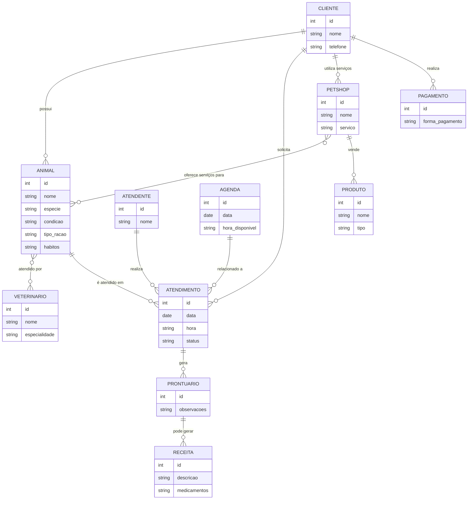

# Elber_Alves
Página da disciplina de Engenharia de Software

- [Elber\_Alves](#elber_alves)
- [1. Introdução](#1-introdução)
- [2. Descrição do sistema](#2-descrição-do-sistema)
  - [Descrição do cenario onde o sistema deverá funcionar:](#descrição-do-cenario-onde-o-sistema-deverá-funcionar)
- [3. Visão geral do sistema](#3-visão-geral-do-sistema)
  - [Descrição do sistema e suas relações](#descrição-do-sistema-e-suas-relações)
- [4. Diagrama ER](#4-diagrama-er)
- [5. Diagrama de classe](#5-diagrama-de-classe)
- [6. Casos de uso](#6-casos-de-uso)
- [7. Diagrama de componentes](#7-diagrama-de-componentes)
- [8. Diagrama de Implantação](#8-diagrama-de-implantação)
- [9. Protótipo de telas](#9-protótipo-de-telas)
- [10 Diagrama de navegação](#10-diagrama-de-navegação)
- [11. Pilha tecnológica](#11-pilha-tecnológica)
- [12. Requisitos de sistemas](#12-requisitos-de-sistemas)
- [13. Considerações sobre segurança](#13-considerações-sobre-segurança)
- [14. Manutenção e instalação](#14-manutenção-e-instalação)
- [15. Glossário](#15-glossário)
- [16. Script SQL](#16-script-sql)
  - [16.1 Comandos create](#161-comandos-create)
  - [16.2 Comandos INSERT gerando dados ficticios;](#162-comandos-insert-gerando-dados-ficticios)


# 1. Introdução

O projeto a seguir apresenta um sistema desenvolvido para uma pethop. A empresa é considerada micro e iniciou as atividades recentemente. Ao possuir serviços exclusivos, os sitemas presentes no mercado não se enquadra, desta forma, os proprietários decidiram desenvolver uma solução própria. Esta solução é detalhada a seguir:

---
# 2. Descrição do sistema

## Descrição do cenario onde o sistema deverá funcionar:

1. Uma clínica veterinária atende apenas os animais: gatos e cachorros.

2. Os clientes devem fazer um cadastro de si e dos animais.

3. Os clientes devem informar as condições nas quais os animais chegam.

4. Os clientes devem informar o tipo de ração que o animal come.

5. O cliente deve informar hábitos do animal.

6. Para cada animal é possível que mais de um veterinário o atenda.

7. Os animais podem chegar e serem atendidos de acordo com uma agenda do dia. 

8. Cada animal atendido receberá uma ficha e um prontuário. 

9. Outros dono podem querer marcar horários de atendimento futuro. 

10. O atendimento gera uma receita para o animal. 

11. Quando um cliente chega na clínica veterinária ele é atendido por um atendente. 

12. O atendente deve verificar se existe agenda disponível com um veterinário. 

13. O atendente deve colocar o cliente e seu animal na fila de espera, se for o caso. 

14. O atendente deve levar o cliente e o animal até o veterinário. 

15. O veterinário deve realizar uma entrevista com o dono do animal. 

16. O resultado da entrevista deve ir para um formulário. 

17. O veterinário deverá examinar o animal e anotar em prontuário(ficha) suas observações. 

18. Dependendo da situação do animal este receberá uma receita.

19. O petshop vende ração de para passaros da especie gralha.

20. O petshop vende sal para boi.

21. O petshop vende vacina para animais adultos acima de 7 anos.

22. O petshop oferece banho e tosa para animais de fazendas.

23. O petshop oferece vacina de animais com raiva.

24. O petshop oferece limpeza de pata de camelo.

25. O petshop oferece banho a gansos da Finlandia.

26. O petshop ajuda o dono na domesticação.

27. O petshop preenche a cardeneta de vacinação.

28. O petshop faz designs na penugem.

29. Fazemos recebimento com saco de algodão.

30. Recebemos o pagamento com galinhas vivas.

---
# 3. Visão geral do sistema

## Descrição do sistema e suas relações

---
# 4. Diagrama ER

```python
print("abc")
```



---
# 5. Diagrama de classe


---
# 6. Casos de uso

---
# 7. Diagrama de componentes

---
# 8. Diagrama de Implantação

---
# 9. Protótipo de telas

---
# 10 Diagrama de navegação

---
# 11. Pilha tecnológica

---
# 12. Requisitos de sistemas

---
# 13. Considerações sobre segurança

---
# 14. Manutenção e instalação

---
# 15. Glossário

---
# 16. Script SQL
## 16.1 Comandos create

```
-- Criação da tabela CLIENTE
CREATE TABLE Cliente (
    id INT AUTO_INCREMENT PRIMARY KEY,
    nome VARCHAR(100) NOT NULL,
    telefone VARCHAR(15) NOT NULL
);

-- Criação da tabela ANIMAL
CREATE TABLE Animal (
    id INT AUTO_INCREMENT PRIMARY KEY,
    nome VARCHAR(100) NOT NULL,
    especie ENUM('gato', 'cachorro') NOT NULL,
    condicao TEXT NOT NULL,
    tipo_racao VARCHAR(100),
    habitos TEXT,
    cliente_id INT,
    FOREIGN KEY (cliente_id) REFERENCES Cliente(id)
);

-- Criação da tabela VETERINARIO
CREATE TABLE Veterinario (
    id INT AUTO_INCREMENT PRIMARY KEY,
    nome VARCHAR(100) NOT NULL,
    especialidade VARCHAR(100)
);

-- Criação da tabela ATENDENTE
CREATE TABLE Atendente (
    id INT AUTO_INCREMENT PRIMARY KEY,
    nome VARCHAR(100) NOT NULL
);

-- Criação da tabela AGENDA
CREATE TABLE Agenda (
    id INT AUTO_INCREMENT PRIMARY KEY,
    data DATE NOT NULL,
    hora TIME NOT NULL,
    veterinario_id INT,
    FOREIGN KEY (veterinario_id) REFERENCES Veterinario(id)
);

-- Criação da tabela ATENDIMENTO
CREATE TABLE Atendimento (
    id INT AUTO_INCREMENT PRIMARY KEY,
    data DATE NOT NULL,
    hora TIME NOT NULL,
    status ENUM('Em andamento', 'Concluído') NOT NULL,
    cliente_id INT,
    animal_id INT,
    atendente_id INT,
    agenda_id INT,
    FOREIGN KEY (cliente_id) REFERENCES Cliente(id),
    FOREIGN KEY (animal_id) REFERENCES Animal(id),
    FOREIGN KEY (atendente_id) REFERENCES Atendente(id),
    FOREIGN KEY (agenda_id) REFERENCES Agenda(id)
);

-- Criação da tabela PRONTUARIO
CREATE TABLE Prontuario (
    id INT AUTO_INCREMENT PRIMARY KEY,
    observacoes TEXT NOT NULL,
    animal_id INT,
    atendimento_id INT,
    FOREIGN KEY (animal_id) REFERENCES Animal(id),
    FOREIGN KEY (atendimento_id) REFERENCES Atendimento(id)
);

-- Criação da tabela RECEITA
CREATE TABLE Receita (
    id INT AUTO_INCREMENT PRIMARY KEY,
    descricao TEXT NOT NULL,
    medicamentos TEXT,
    prontuario_id INT,
    FOREIGN KEY (prontuario_id) REFERENCES Prontuario(id)
);

-- Criação da tabela PETSHOP
CREATE TABLE Petshop (
    id INT AUTO_INCREMENT PRIMARY KEY,
    nome VARCHAR(100) NOT NULL
);

-- Criação da tabela PRODUTO
CREATE TABLE Produto (
    id INT AUTO_INCREMENT PRIMARY KEY,
    nome VARCHAR(100) NOT NULL,
    tipo VARCHAR(50) NOT NULL
);

-- Criação da tabela SERVICO
CREATE TABLE Servico (
    id INT AUTO_INCREMENT PRIMARY KEY,
    descricao TEXT NOT NULL
);

-- Criação da tabela PETSHOP_SERVICO
CREATE TABLE Petshop_Servico (
    petshop_id INT,
    servico_id INT,
    PRIMARY KEY (petshop_id, servico_id),
    FOREIGN KEY (petshop_id) REFERENCES Petshop(id),
    FOREIGN KEY (servico_id) REFERENCES Servico(id)
);

-- Criação da tabela PETSHOP_PRODUTO
CREATE TABLE Petshop_Produto (
    petshop_id INT,
    produto_id INT,
    PRIMARY KEY (petshop_id, produto_id),
    FOREIGN KEY (petshop_id) REFERENCES Petshop(id),
    FOREIGN KEY (produto_id) REFERENCES Produto(id)
);

-- Criação da tabela PAGAMENTO
CREATE TABLE Pagamento (
    id INT AUTO_INCREMENT PRIMARY KEY,
    forma_pagamento ENUM('dinheiro', 'cartão', 'galinhas vivas', 'saco de algodão') NOT NULL,
    cliente_id INT,
    FOREIGN KEY (cliente_id) REFERENCES Cliente(id)
);

-- Inserção dos dados dos produtos do petshop
INSERT INTO Produto (nome, tipo) VALUES 
('Ração para pássaros da espécie gralha', 'ração'),
('Sal para boi', 'sal'),
('Vacina para animais adultos acima de 7 anos', 'vacina');

-- Inserção dos dados dos serviços do petshop
INSERT INTO Servico (descricao) VALUES 
('Banho e tosa para animais de fazenda'),
('Vacina para animais com raiva'),
('Limpeza de pata de camelo'),
('Banho para gansos da Finlândia'),
('Auxílio na domesticação'),
('Preenchimento da caderneta de vacinação'),
('Designs na penugem');

-- Exemplo de ligação entre petshop e serviços/produtos
INSERT INTO Petshop (nome) VALUES ('Petshop AnimalCare');
INSERT INTO Petshop_Servico (petshop_id, servico_id) VALUES (1, 1), (1, 2), (1, 3);
INSERT INTO Petshop_Produto (petshop_id, produto_id) VALUES (1, 1), (1, 2), (1, 3);

```


## 16.2 Comandos INSERT gerando dados ficticios;
```SQL
-- Inserindo dados na tabela CLIENTE
INSERT INTO Cliente (nome, telefone) VALUES
('João Silva', '123456789'),
('Maria Oliveira', '987654321'),
('Carlos Pereira', '555555555'),
('Ana Souza', '444444444');

-- Inserindo dados na tabela ANIMAL
INSERT INTO Animal (nome, especie, condicao, tipo_racao, habitos, cliente_id) VALUES
('Rex', 'cachorro', 'Leve dor na pata', 'Ração Premium', 'Corre no parque todos os dias', 1),
('Luna', 'gato', 'Apatia e febre', 'Ração para gatos', 'Dorme o dia todo', 2),
('Max', 'cachorro', 'Problema respiratório', 'Ração natural', 'Brinca com outros cães', 3),
('Mimi', 'gato', 'Perda de apetite', 'Ração para gatos idosos', 'Costuma caçar ratos', 4);

-- Inserindo dados na tabela VETERINARIO
INSERT INTO Veterinario (nome, especialidade) VALUES
('Dr. Pedro Costa', 'Clínica geral'),
('Dra. Fernanda Lima', 'Dermatologia'),
('Dr. Ricardo Almeida', 'Cardiologia'),
('Dra. Laura Mendes', 'Neurologia');

-- Inserindo dados na tabela ATENDENTE
INSERT INTO Atendente (nome) VALUES
('Carla Santos'),
('Lucas Oliveira'),
('Mariana Silva'),
('Rafael Costa');

-- Inserindo dados na tabela AGENDA
INSERT INTO Agenda (data, hora, veterinario_id) VALUES
('2024-09-17', '10:00', 1),
('2024-09-17', '11:00', 2),
('2024-09-17', '14:00', 3),
('2024-09-18', '09:00', 4);

-- Inserindo dados na tabela ATENDIMENTO
INSERT INTO Atendimento (data, hora, status, cliente_id, animal_id, atendente_id, agenda_id) VALUES
('2024-09-17', '10:00', 'Concluído', 1, 1, 1, 1),
('2024-09-17', '11:00', 'Concluído', 2, 2, 2, 2),
('2024-09-17', '14:00', 'Em andamento', 3, 3, 3, 3),
('2024-09-18', '09:00', 'Agendado', 4, 4, 4, 4);

-- Inserindo dados na tabela PRONTUARIO
INSERT INTO Prontuario (observacoes, animal_id, atendimento_id) VALUES
('O animal apresenta leve inflamação na pata, recomendada fisioterapia.', 1, 1),
('Gato com febre, foi prescrito antibiótico.', 2, 2),
('Animal com dificuldade respiratória, diagnosticado com bronquite canina.', 3, 3);

-- Inserindo dados na tabela RECEITA
INSERT INTO Receita (descricao, medicamentos, prontuario_id) VALUES
('Fisioterapia semanal por 1 mês.', 'Anti-inflamatório 2x ao dia', 1),
('Antibiótico por 7 dias', 'Amoxicilina 50mg 2x ao dia', 2),
('Inalação diária por 2 semanas', 'Broncodilatador 3x ao dia', 3);

-- Inserindo dados na tabela PETSHOP
INSERT INTO Petshop (nome) VALUES
('Petshop AnimalCare');

-- Inserindo dados na tabela PRODUTO
INSERT INTO Produto (nome, tipo) VALUES
('Ração para pássaros da espécie gralha', 'ração'),
('Sal para boi', 'sal'),
('Vacina para animais adultos acima de 7 anos', 'vacina');

-- Inserindo dados na tabela SERVICO
INSERT INTO Servico (descricao) VALUES
('Banho e tosa para animais de fazenda'),
('Vacina para animais com raiva'),
('Limpeza de pata de camelo'),
('Banho para gansos da Finlândia'),
('Auxílio na domesticação'),
('Preenchimento da caderneta de vacinação'),
('Designs na penugem');

-- Inserindo dados na tabela PETSHOP_SERVICO
INSERT INTO Petshop_Servico (petshop_id, servico_id) VALUES
(1, 1), 
(1, 2), 
(1, 3), 
(1, 4), 
(1, 5), 
(1, 6), 
(1, 7);

-- Inserindo dados na tabela PETSHOP_PRODUTO
INSERT INTO Petshop_Produto (petshop_id, produto_id) VALUES
(1, 1), 
(1, 2), 
(1, 3);

-- Inserindo dados na tabela PAGAMENTO
INSERT INTO Pagamento (forma_pagamento, cliente_id) VALUES
('dinheiro', 1),
('cartão', 2),
('galinhas vivas', 3),
('saco de algodão', 4);
```
